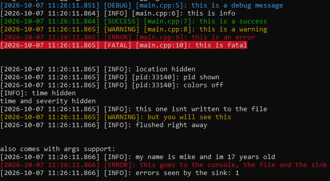

# logging

small header-only c++ logger. colored console output, writes to a file, thread safe. i made it because i got tired of rewriting the same cout stuff in every project



> [!NOTE]
> yes the readme is ai generated as i do not have time to write it by myself

## features

- 6 severity levels: debug, info, success, warning, error, fatal
- colored output in the console (using termcolor, already included)
- also writes everything to `log.txt` (appends, doesnt overwrite)
- `error` and `fatal` go to stderr
- `std::format` style args, so `logging::info("x = {}", 5)` just works
- toggle the time, severity, pid and [file:line] parts, and the colors
- set a minimum severity to hide the spam
- custom sinks, so you can send the logs somewhere else too
- optional abort on fatal

## usage

copy the `include` folder into your project and include it

```cpp
#include "include/logging.hpp"

int main()
{
    logging::info("this is info");
    logging::success("it worked");
    logging::warning("this is a warning");
    logging::error("this is an error");

    logging::info("my name is {} and im {} years old", "mike", 17);
}
```

output looks something like

```
[2026-10-07 07:26:12.345] [INFO] [main.cpp:5]: this is info
```

with the pid option on it looks like

```
[2026-10-07 07:26:12.345] [INFO] [pid:1234] [main.cpp:5]: this is info
```

## settings

everything goes through the logger singleton

```cpp
auto& log = logging::logger::get();

// what the line looks like
log.set_show_time(false);       // hide the timestamp
log.set_show_severity(false);   // hide the [INFO] part
log.set_show_location(false);   // hide the [file:line] part
log.set_show_pid(true);         // show [pid:1234] (off by default)
log.set_use_color(false);       // no colors in the console (file is always plain)
log.set_use_stderr(false);      // error and fatal go to stdout like everything else

// what gets logged
log.set_min_severity(logging::severity::warning);  // ignore anything below warning

// file
log.set_file("other.txt");      // change the log file (default is log.txt)
log.set_log_to_file(false);     // dont write to a file (log.txt never gets created)
log.set_auto_flush(true);       // flush after every line, see below
log.flush();                    // force everything to disk right now

// fatal
log.set_abort_on_fatal(true);   // flush and abort() after a fatal message (off by default)
```

severity order is in `severity.hpp`

### flushing

by default the file only gets flushed on warning and above, so logging a lot of info/debug stuff is fast. if the program crashes you might lose the last few info lines, but warnings and errors are always on disk. `set_auto_flush(true)` flushes every line if you dont care about speed

## sinks

a sink is a function that gets every log line, so you can send logs somewhere else (a gui window, a webhook, whatever)

```cpp
log.add_sink([](logging::severity s, const std::string& line)
{
    if (s >= logging::severity::error) send_to_webhook(line);
});

log.clear_sinks(); // remove all of them
```

- you get plain text, no colors
- only lines that pass the min severity
- logging from inside a sink does nothing (otherwise it would deadlock)
- if a sink throws it gets ignored

## requirements

- c++20 (uses `<format>`, `<source_location>` and concepts)
- msvc, the project is set up for visual studio (v145 toolset)

## building the test

open `logging.slnx` in visual studio and run it. the test is in `tests/main.cpp`

## license

do whatever you want with it